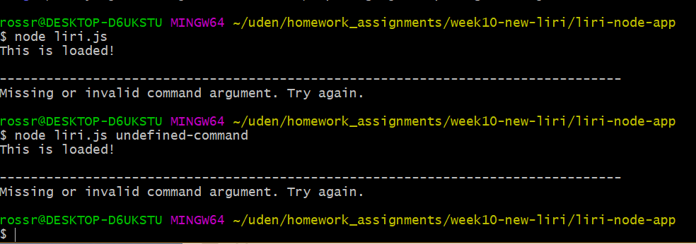
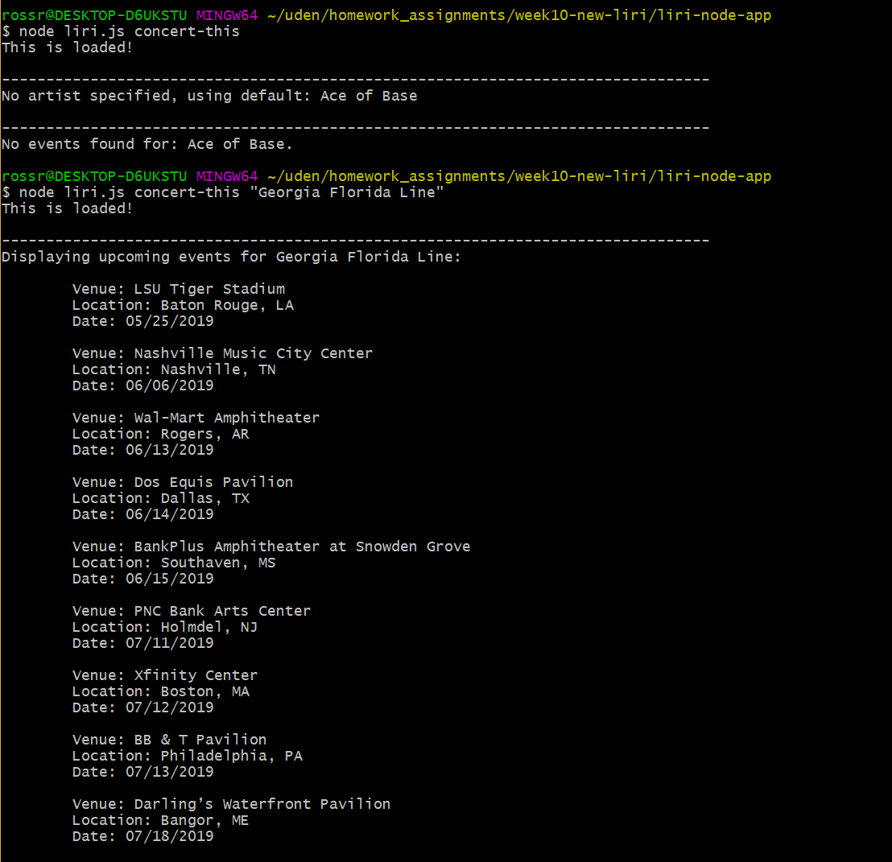
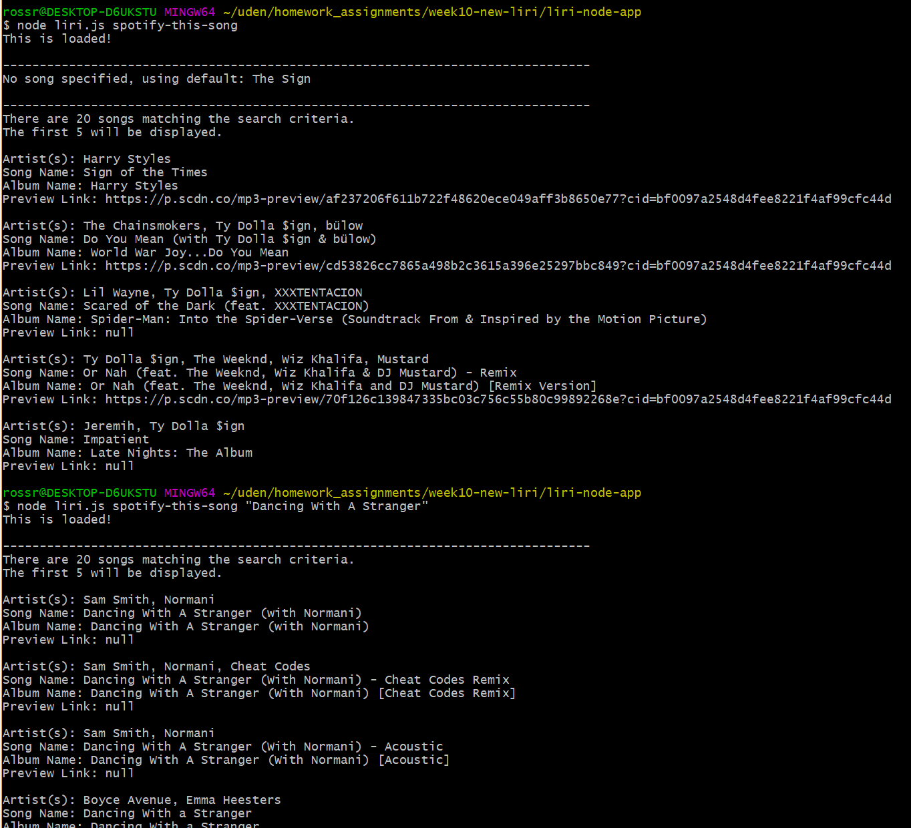
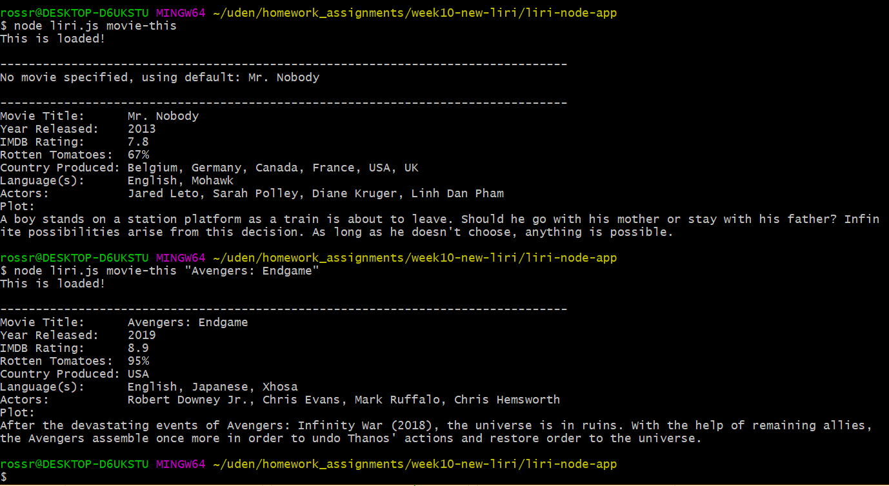
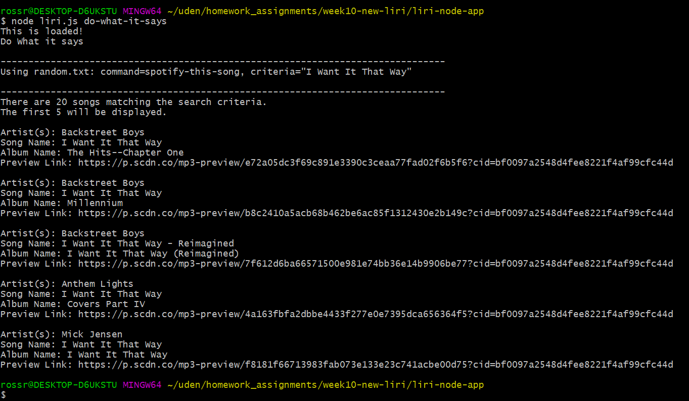

# LIRI Bot

Liri is a command line node app that takes in parameters and returns data 
about music, movies, and bands.

### Overview

LIRI uses a command line interface to obtain user search requests. It then 
searches Spotify for songs, Bands in Town for concerts, and OMDB for movies.
Results are logged to the console.

### Executing LIRI

LIRI is executed using node.js Command line arguments specify the command to
execute and the criteria used with the command. 

Examples:

* node liri.js concert-this <artist/band name here>

    This command will search the Bands in Town website for upcoming events for
    the specified artist or band, and display them on the console. If an artist
    is not specified, a default will be used.

* node liri.js spotify-this-song <song name here>

    This command will search the Spotify website for the specified song, and
    display the results on the console. If a song is not specified, a default
    will be used.

* node liri.js movie-this <movie name here>

    This command will search the OMDB website for the specified movie, and
    display the results on the console. If a movie is not specified, a default
    will be used.

* node liri.js do-what-it-says

    This command will read one of the above commands and criteria from a text 
    file, random.txt, and execute the specified command.

### Package Dependencies

* Axios - Used to send requests to the Bands In Town and OMDB APIs.
* Moment - Used to format dates.
* DotEnv - Used to obtain configuration data and keep keys secure.
* Node-Spotify-API - Used to access Spotify
* fs Node package - Used to access the text file.

### Screenshots

The links to the following screenshots illustrate the functionality of the 
application.

*  The first image illustrates
the error conditions generated by either not entering a command argument or
entering an invalid command.

*  This image illustrates using the
**concert-this** command. The first execution does not specify an artist or
band, so a default of 'Ace of Base' is used. The artist has no upcoming 
concerts. The second execution specifies, 'Georgia Florida Line', which lists
the upcoming concerts.

*  This image uses the
**spotify-this-song** command. The first execution does not specify a song,
so a default of 'The Sign' is used. The second execution specifies,
'Dancing With A Stranger'. This command has a maximum limit of song listings
that it will display.

*  The image for the **movie-this** command
demonstrates first, no criteria, in which case 'Mr. Nobody' is used as the 
default. In the second execution, 'Avengers: Endgame' is used as the criteria.

*  This image uses the command,
**do-what-it-says**, which reads the contents of a text file containing the
command and criteria in the following format: 
    **spotify-this-song,"I Want It That Way"** (with no spaces)
The text file may be modified to use any of the above commands.

